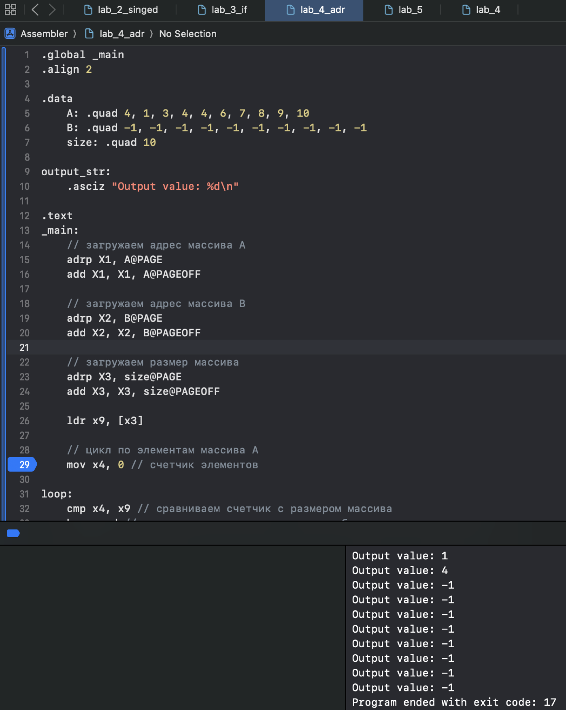
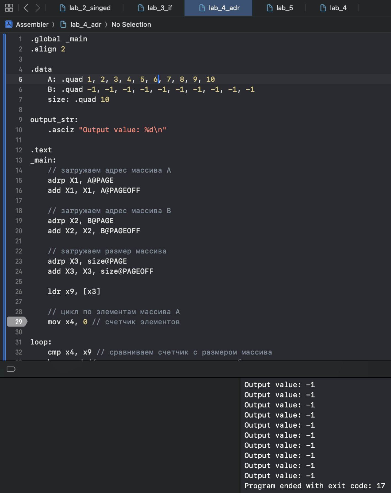
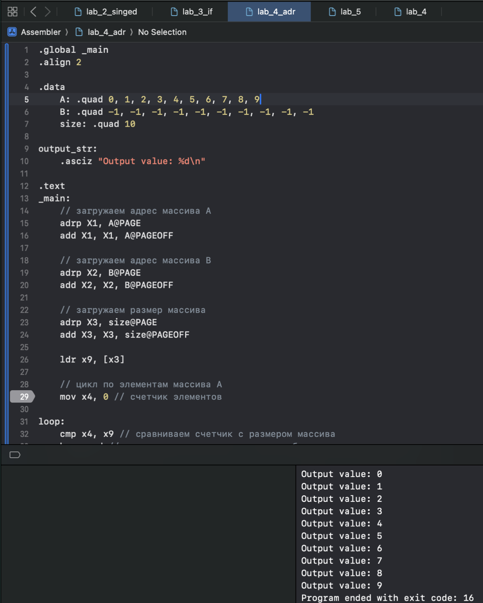

# Лабораторная работа №4
## Косвенная адресация

### Вариант #19
```text
Переписать из массива А в массив В те элементы массива А, индексы которых совпадают со значениями.
```

---
<p >
  
  
  
</p>
